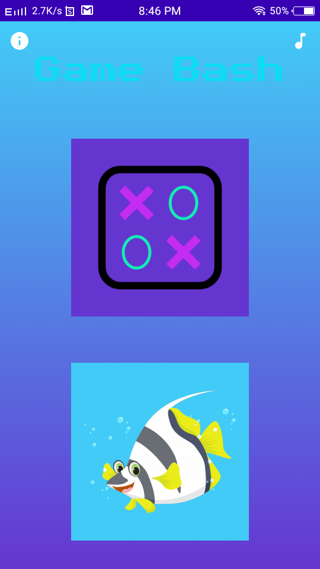
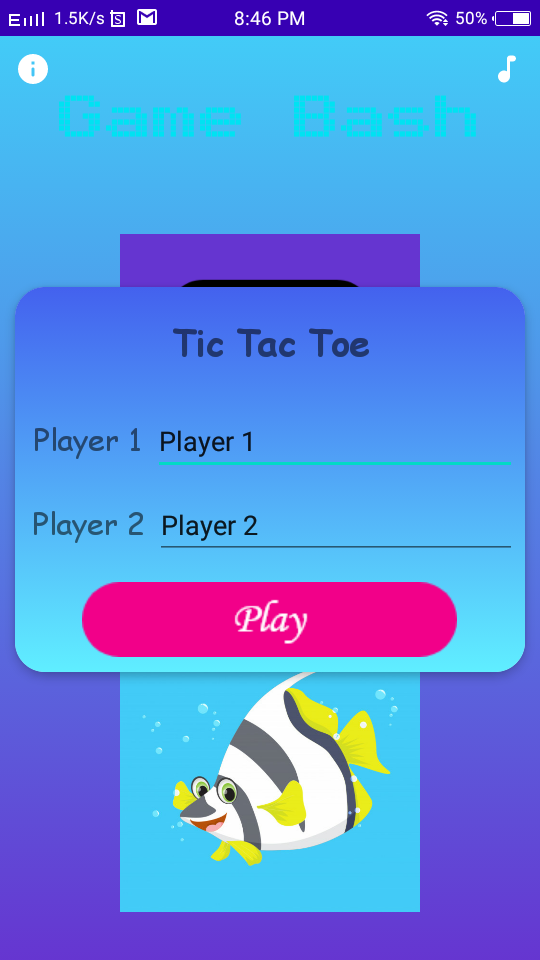
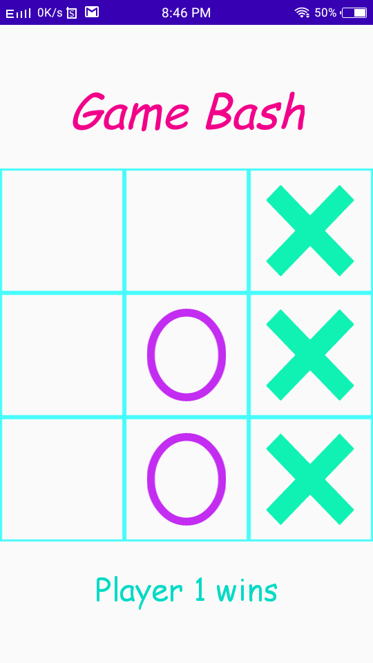
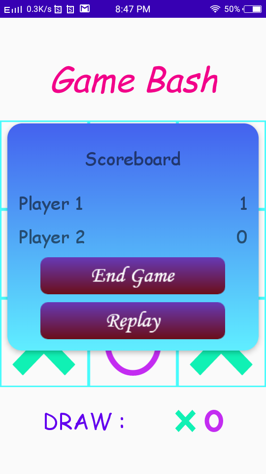
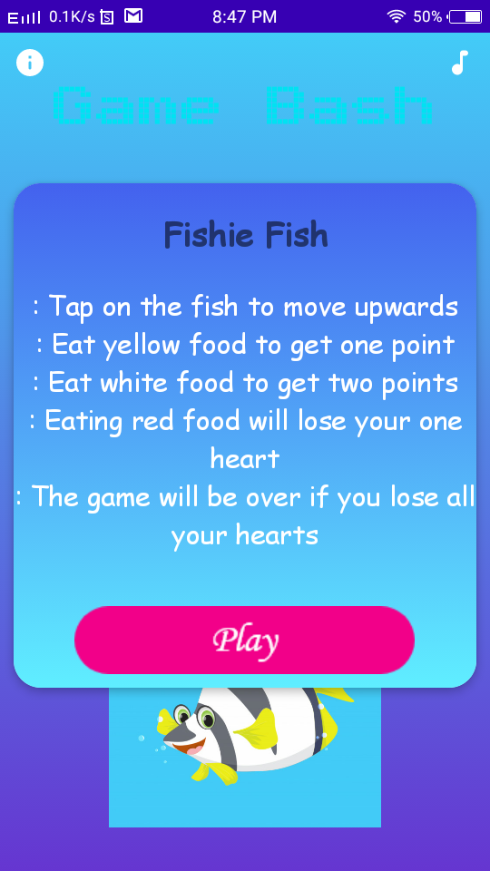
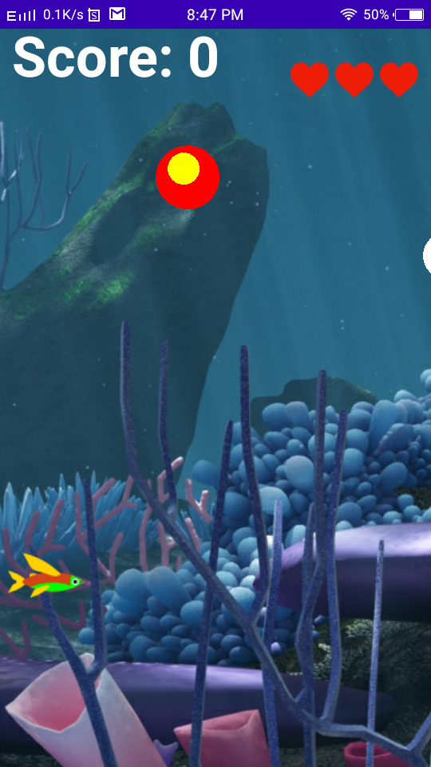
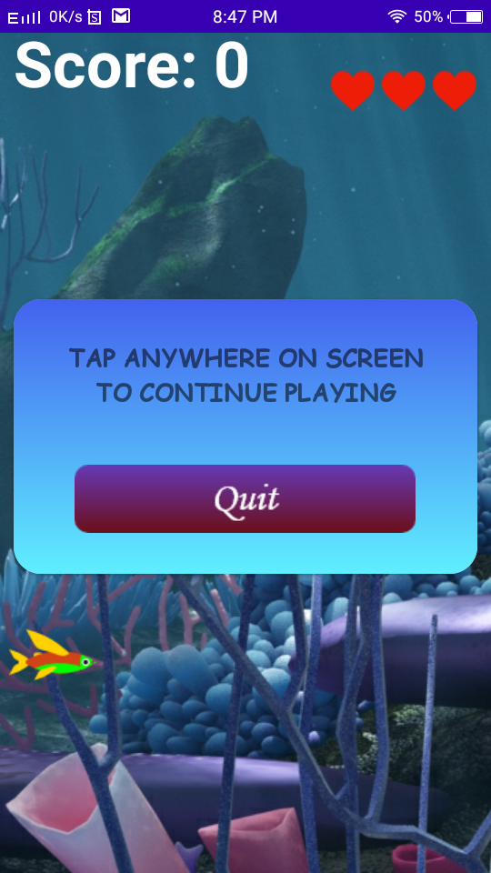
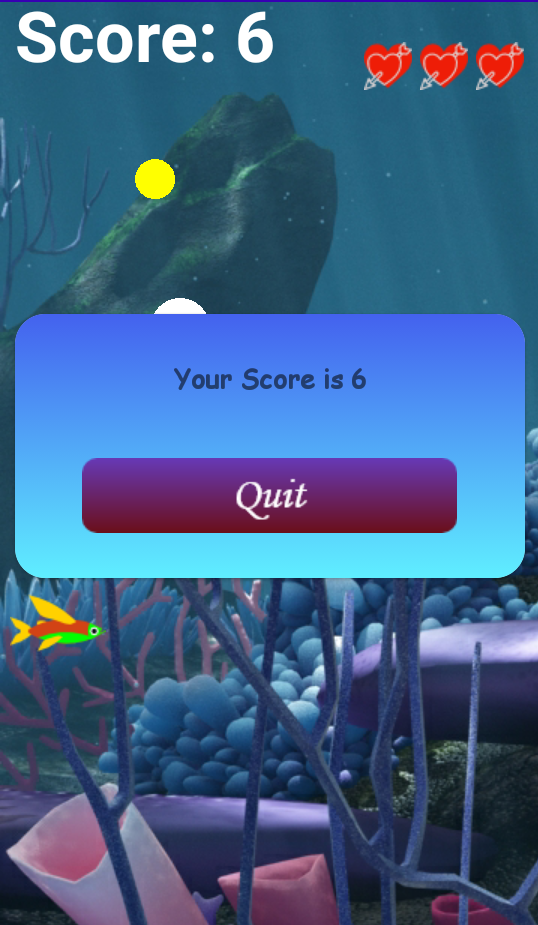

# Game_Bash
This is a Game devloped under IT Mini Project. It includes two games as TIC TAC TOE and FISHIE FISH. Hope you'll like the game.

        Tic Tac Toe :

        Tic Tac Toe is free classic puzzle game also known as Noughts and Crosses or sometimes X and O.
        The Tic Tac Toe game is a game for two players, who take turns marking the spaces in a 3×3 grid. The player who succeeded in placing three respective marks in a horizontal, vertical, or diagonal row wins the game.
        The Tic Tac Toe is a great way to pass your free time whether you\'re standing in a line or spending time with your kids. Stop wasting paper and save trees. Because of the simplicity of Tic Tac Toe, it is often used as a pedagogical tool for teaching the concepts of good sportsmanship and the branch of artificial intelligence.
        Start playing Tic Tac Toe game on your Android device now.

        Fishie Fish :
        Fishie fish is a game in which player will be riding inside the fish which does not know which food it can eat among all food available inside the sea.
        Basically this fish is a herbivore. So, Player should be guiding the fish to plants or fruits. Player will be awarded one point for each food he takes and 2 points for food with high calories. But fish dies if it takes meat 3 times.
        Basically, it is a 2D game in which player must guide the fish the altitude at which the fish must swim. It eats what all is just in front of it at some altitude.
        The altitude of fish increases as we touch the screen multiple times and altitude decreases as we reduce frequency of touching.
        Red ball denotes meat, White ball denotes algae wafers(More Calory food) and Yellow ball denotes normal veggies.
        Start playing Fishie Fish game on your Android device now.

# Screenshots :

